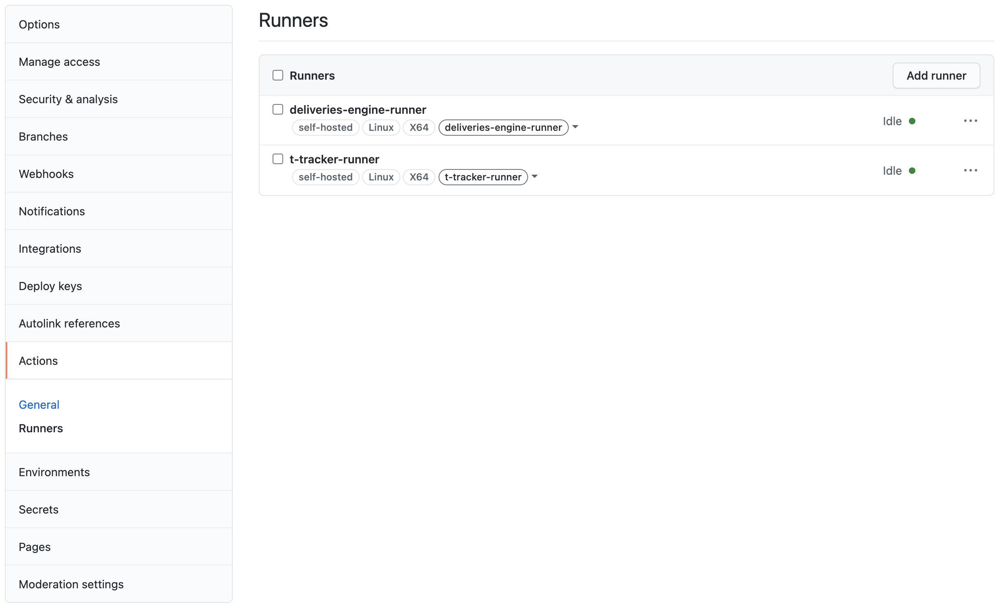

# CI/CD Workflow

## CI - Continuous Integration

For the **CI** part, there are two scripts, one for each project, both of them will run on the latest **ubuntu** image.

* **deliveries-engine.yml**: this worflow will trigger 2 jobs:
    
    * **build** - build the deliveries-engine Maven project, checking if it succeeds
    * **sonar** - runs the SonarCloud static code analysis for the deliveries-engine project, checking if it passes the quality gate

* **t-tracker.yml**: this worflow will trigger two jobs:
    
    * **build** - build the t-tracker Maven project, checking if it succeeds
    * **sonar** - runs the SonarCloud static code analysis for the t-tracker project, checking if it passes the quality gate 

## CD - Continuous Deployment

For the **CD** part, there are also two scripts, one for each project, but, in this case, each one of them will run on a [**GitHub Self-Hosted Runner**](https://docs.github.com/en/actions/hosting-your-own-runners/about-self-hosted-runners) installed on the given virtual machine.

<p align="center">
    
</p>

These runners allow us to easily deploy our projects, when pushing/pull requesting to specific branches.

There was an issue with the _sudo_ command, as the runners were running on one of the group members' user, and this depends on the UA's IDP, this could give permissions/timeouts errors, when executing the 

I created a new user, giving him root permissions. This can be done with the following commands:

```shell
$ sudo adduser [username]
```
```shell
$ sudo usermod -aG sudo [username]
```

After this step, we just have to enter the VM through the from the new user through SSH, with the previously defined password:

```shell
$ ssh [username]@deti-tqs-01.ua.pt
```

And install the runners through this new user. This prevented the previous errors from ocurring.