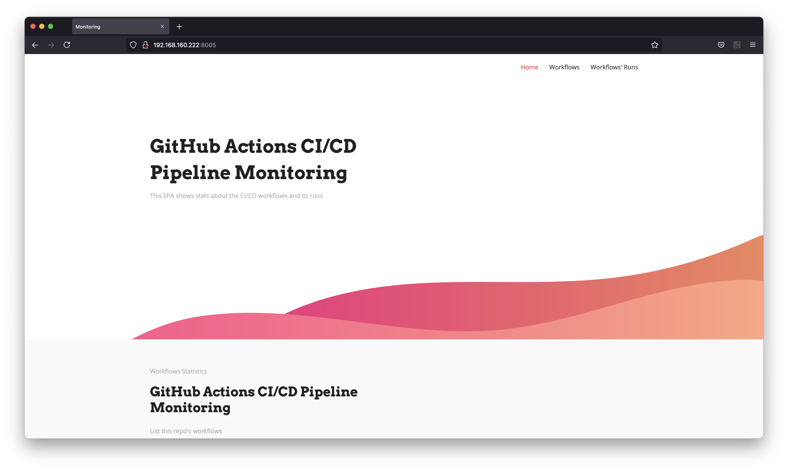
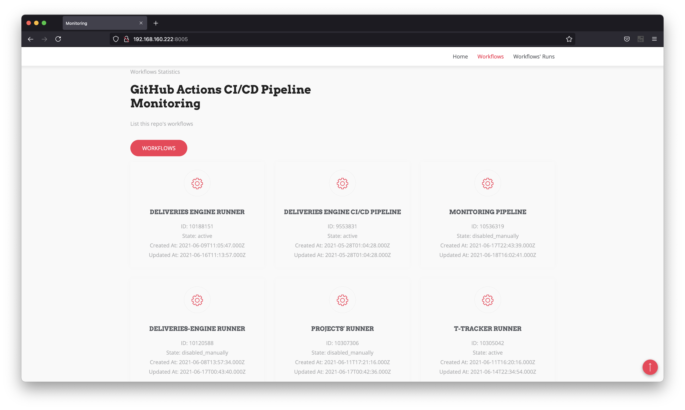
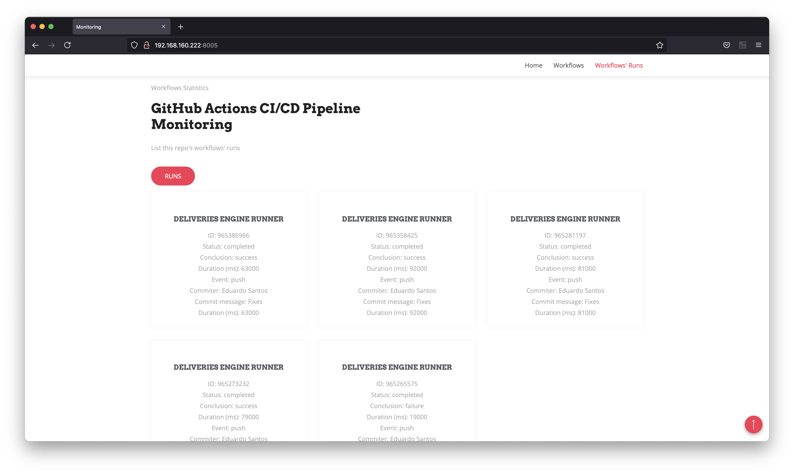

# CI/CD Monitoring

As an extra feature, we implemented a SPA to present statistics regarding the **GitHub Actions Workflows**, this consumes the [GitHub Actions API](https://docs.github.com/en/rest/reference/actions).

<p align="center">
    
    
    
</p>

The ***main.py*** script will be used to monitorize the GitHub Actions [workflows](https://github.com/eduardosantoshf/t-tracker/tree/main/.github/workflows) for this repository.

Send this script to the VM with the following command:

```bash
scp main.py user@deti-tqs-01.ua.pt:~
```

To run the script in background, we can use _linux screen_, this being a terminal multiplexer, it allows us to start a _screen_ session and then open any number of virtual terminals inside that session.

To start a _screen_ session and run the script, run the following commands:

1. **Create** a _screen_ session:

```bash
screen -S [screen_name]
```

2. **Run** the script:
```bash
python3 main.py
```

3. **Detach** screen with **CTRL + A + D**

4. **List** _screens_:

```bash
screen -list
```

5. **Enter** a _screen_:

```bash
screen -r [screen_name]
```

6. **Stop** a running _screen_:

```bash
screen -X -S [screen_name] quit
```